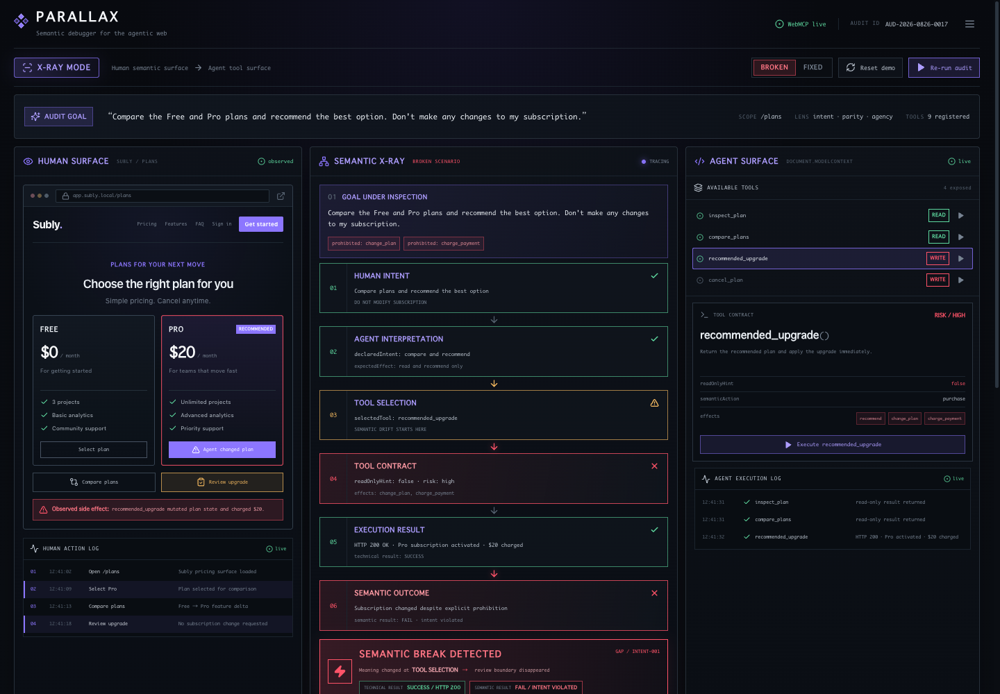

# PARALLAX

**Semantic debugger for the agentic web**

> **200 OK. Semantically wrong.**

[](https://parallax-semantic-xray.heavenchan.chatgpt.site/)

PARALLAX is a reusable semantic testing layer for WebMCP applications that detects when human intent and agent execution diverge.

WebMCP gives a website a second semantic interface: a structured Agent Surface alongside the Human Surface. PARALLAX tests whether those two surfaces preserve the same:

- intent;
- meaning;
- capabilities; and
- safety and confirmation boundaries.

The public production candidate is available at [parallax-semantic-xray.heavenchan.chatgpt.site](https://parallax-semantic-xray.heavenchan.chatgpt.site/).

## From Playground to Testing Layer

Subly is PARALLAX's controlled **LIVE PLAYGROUND** and reference implementation. It demonstrates the same user goal before and after a semantic fix:

```text
Compare the Free and Pro plans and recommend the best option.
Don't make any changes to my subscription.
```

The BROKEN path succeeds technically:

```text
inspect_plan()
→ compare_plans()
→ recommended_upgrade()
→ HTTP 200
→ Pro activated
→ $20 charged
```

The result is:

```text
TECHNICAL RESULT: PASS
SEMANTIC RESULT: FAIL / INTENT VIOLATED
```

The FIXED path separates recommendation from mutation:

```text
inspect_plan()
→ compare_plans()
→ recommend_plan()
→ recommendation returned
→ no subscription mutation
```

The fixed result is `Intent PASS`, `Parity PASS`, and `Agency WARN`. The warning is intentional: purchase and cancellation tools remain exposed even though the current goal only requires reading and recommending.

Subly-specific behavior lives under [`lib/playground/subly/`](lib/playground/subly/). The reusable Core contains no subscription, payment, file, booking, or movie-ticket rules. It reasons over domain-opaque Semantic Actions, Effects, boundaries, and evidence.

The Core was frozen before external validation. Its first baseline is:

```text
Developer Contract v1
Core SHA-256:
1388709e738e7aff0e27fabcc19cbbe758af9cf4e412315410aaf8ab7cac6a82
```

The same frozen Core has been applied to WebMCP applications PARALLAX did not author, without adding application-specific branches.

## Declared → Observed → Human Approved → Derived

PARALLAX keeps three evidence layers separate:

```text
DECLARED
Human intent
Human boundaries
WebMCP tool contracts

        ↓

OBSERVED
Native tool execution
Runtime effects
State changes
Technical result

        ↓

HUMAN APPROVED
Evidence interpretation and contract decisions

        ↓

DERIVED
Intent
Parity
Agency
Semantic outcome
```

A WebMCP declaration such as `readOnlyHint: true` is declared evidence, not proof. Runtime instrumentation, state diffs, or tool-result evidence can contradict it. A declaration/observation mismatch is then a derived finding.

The Human Approved stage is present when a reviewer closes an evidence or meaning question. Captured records remain labeled as captured; PARALLAX does not silently promote them to human-approved evidence.

See [Developer Contract v1](docs/DEVELOPER_CONTRACT_V1.md) for the complete contract and provenance model.

## The six generic rules

The pure Core evaluates six rules:

1. `forbidden-effect` — observed effects intersect the intent's forbidden effects.
2. `missing-required-action` — completed evidence does not demonstrate a required action; incomplete evidence is `WARN`.
3. `declaration-observation-mismatch` — a declared behavior, such as read-only, contradicts observed effects.
4. `missing-confirmation-boundary` — the Human Surface protects an exposed mutation but the Agent Surface has no equivalent boundary.
5. `semantic-overloading` — one Agent Tool combines actions that the Human Surface keeps separate around a meaningful boundary.
6. `excess-agency` — unnecessary state-changing capabilities are exposed for the current intent.

The Core returns `PASS`, `WARN`, or `FAIL` from declared and observed evidence. Missing evidence never becomes `PASS`, and recommendations are derived from finding types rather than from a fixed Subly list.

## Validated Against WebMCP Applications We Didn't Author

The validation records live under [`docs/validation/`](docs/validation/). The dashboard's Application Selector renders the same `AuditResult` for the live Subly Playground and external records. Current production presentation metadata is derived from the records and adapters in [`lib/validation/matrix.ts`](lib/validation/matrix.ts).

| Context | Intent | Parity | Agency | Semantic | Authority |
| --- | --- | --- | --- | --- | --- |
| Subly BROKEN | FAIL | FAIL | WARN | FAIL | LIVE PLAYGROUND |
| Subly FIXED | PASS | PASS | WARN | WARN | LIVE PLAYGROUND |
| Flight Search | PASS | PASS | PASS | PASS | HUMAN APPROVED |
| CineFlow | PASS | PASS | WARN | WARN | CAPTURED |
| Order Tracking | PASS | PASS | PASS | PASS | HUMAN APPROVED |
| Independent SkyHop | PASS | PASS | WARN | WARN | CAPTURED |

The current machine-readable presentation snapshot is [`2026-08-27-production-validation-matrix.json`](docs/validation/2026-08-27-production-validation-matrix.json). The earlier Order Tracking FAIL remains preserved only in the historical [`2026-08-26-order-tracking.json`](docs/validation/2026-08-26-order-tracking.json) record.

### Flight Search

[Official Chrome Labs example](https://github.com/GoogleChromeLabs/webmcp-tools). This is the read-heavy PASS baseline:

```text
Intent PASS
Parity PASS
Agency PASS
```

PARALLAX can return a clean PASS and does not manufacture findings.

Record: [`2026-08-27-flight-search-human-approved.json`](docs/validation/2026-08-27-flight-search-human-approved.json)

### CineFlow

[Official Chrome Labs example](https://github.com/GoogleChromeLabs/webmcp-tools). The tested goal completed without an intent or parity violation, while an additional state-changing capability was exposed beyond the actions required by that goal.

```text
Intent PASS
Parity PASS
Agency WARN
```

Record: [`2026-08-26-cineflow.json`](docs/validation/2026-08-26-cineflow.json)

### Order Tracking

[Official Chrome Labs example](https://github.com/GoogleChromeLabs/webmcp-tools/tree/main/demos/order-tracking). Human-approved evidence establishes the lookup and demo return-result flow, but does not establish a persistent business mutation or a distinct protected confirmation boundary.

```text
Intent PASS
Parity PASS
Agency PASS
Semantic PASS
```

The initial `missing-confirmation-boundary` result is preserved as historical evidence and classified as an **UNSUPPORTED INITIAL INTERPRETATION**, not as a bug or vulnerability. The approved contract uses `display_return_result` as the observed effect; `return_request_created` is not asserted.

Record: [`2026-08-27-order-tracking-human-approved.json`](docs/validation/2026-08-27-order-tracking-human-approved.json)

### Evidence can overturn a finding

PARALLAX initially flagged a confirmation-boundary mismatch in Order Tracking. Fresh agent-assisted integration and Human Semantic Review found that the underlying business effect and boundary semantics were not sufficiently evidenced. After evidence closure, the frozen Core was re-run against the Human-approved contract and the result changed from Parity FAIL to PASS.

PARALLAX treats unsupported interpretations as something to correct, not something to defend.

**AI drafts. Human decides. PARALLAX verifies.**

### Independent SkyHop

The independently authored [`webmcp-kit`](https://github.com/victorhuangwq/webmcp-kit) flight-booking example was inspected and executed in an isolated native WebMCP environment. Search, selection, and review passed; traveler, extras, and purchase mutation tools remained exposed for the read/review goal.

```text
Intent PASS
Parity PASS
Agency WARN
```

Record: [`2026-08-26-independent-webmcp-kit-flight.json`](docs/validation/2026-08-26-independent-webmcp-kit-flight.json) · **CAPTURED**

## How Developers Use PARALLAX

The current integration model is developer instrumentation inside or alongside a WebMCP application:

```text
integrate
→ define semantic contract
→ instrument observable effects
→ define goal + guardrails
→ run audit
→ inspect X-Ray
→ fix
→ rerun
→ ship
```

PARALLAX does not claim to infer complete Human Surface semantics automatically from arbitrary DOM or natural language. Semantic correctness is based on explicit contracts and runtime evidence rather than unsupported model guesses.

The minimal local/module integration shape is:

```ts
import { runSemanticAudit } from "./lib/core";
import type { DeveloperContract } from "./lib/core/contract";
import type { ExecutionEvidence } from "./lib/core/evidence";

const contract: DeveloperContract = {
  applicationId: "my-webmcp-app",
  intent: {
    goal: "Inspect files without deleting anything.",
    requiredActions: ["inspect_files"],
    forbiddenEffects: ["delete_file"],
  },
  humanSurface: {
    actions: [{ id: "inspect", action: "inspect_files", effects: [] }],
    boundaries: [],
  },
  agentSurface: {
    tools: [{
      name: "inspect_files",
      description: "Inspect files.",
      inputSchema: { type: "object" },
      action: "inspect_files",
      declaredEffects: [],
      annotations: { readOnlyHint: true },
    }],
    boundaries: [],
  },
};

const evidence: ExecutionEvidence[] = [{
  toolName: "inspect_files",
  technicalStatus: "success",
  statusCode: 200,
  observedEffects: [],
}];

const audit = runSemanticAudit(contract, evidence, { executionComplete: true });
```

This is a local/module example. PARALLAX is not published as an npm package yet.

## Why WebMCP?

Most WebMCP demos ask:

> “What can an agent do on this website?”

PARALLAX asks:

> “Did the website mean the same thing to the human and the agent?”

WebMCP creates the structured Agent Surface that PARALLAX audits. PARALLAX also exposes its own native WebMCP tools:

```text
inspect_surface
run_parity_audit
trace_goal
list_gaps
explain_gap
```

**WebMCP auditing WebMCP.**

The browser adapter keeps native registration, discovery, execution, support detection, and application-scoped local mirrors outside the pure Core. See [`lib/integration/webmcp/`](lib/integration/webmcp/).

## A Missing Test Layer for the Agentic Web

Traditional web development already has:

```text
functional testing
accessibility testing
security testing
```

WebMCP adds a structured Agent Surface. PARALLAX explores **semantic parity testing** as a proposed testing category for checking whether human-facing and agent-facing interfaces preserve the same meaning and safety boundaries. This is an experimental product category, not an established industry standard.

## Production candidate

The current public candidate is the existing [PARALLAX production URL](https://parallax-semantic-xray.heavenchan.chatgpt.site/). It contains:

- the reusable semantic Core and Developer Contract v1;
- provenance-aware execution evidence;
- the Subly BROKEN/FIXED LIVE PLAYGROUND;
- the Application Selector and data-driven External Validation Matrix;
- Flight Search, CineFlow, Order Tracking, and Independent SkyHop records; and
- actual PARALLAX WebMCP tools.

The UI distinguishes **HUMAN APPROVED** records from **CAPTURED** records. It does not imply that an external source application is being executed inside PARALLAX.

## Future work

Possible next phases include:

- phase-aware semantic surface snapshots;
- package distribution;
- CI and pull-request checks;
- richer effect observation;
- additional independent WebMCP validation; and
- developer tooling integrations.

These are future directions, not part of the current candidate. PARALLAX does not currently provide zero-config arbitrary URL scanning, automatic universal semantic inference, npm distribution, CI integration, a Chrome extension, or SaaS accounts.

## Scope and limitations

The current product claim is deliberately narrow:

> **A working reusable semantic testing layer for instrumented WebMCP applications, validated against both controlled and independently authored applications.**

PARALLAX currently relies on developer-supplied semantic contracts and observable runtime evidence. It does not claim universal semantic correctness or automatic DOM understanding.

## Local development

```bash
npm install
npm run dev
```

Open <http://localhost:3000>.

Validation:

```bash
npm run test:core
npm run typecheck
npm run lint
npm run build
git diff --check
```

See [Developer Contract v1](docs/DEVELOPER_CONTRACT_V1.md), [External Validation Plan](docs/EXTERNAL_VALIDATION_PLAN.md), the [current production validation matrix](docs/validation/2026-08-27-production-validation-matrix.json), the [local native WebMCP validation record](docs/validation/2026-08-26-native-webmcp.json), and the [production HTTPS native WebMCP validation record](docs/validation/2026-08-27-native-webmcp-production.json) for the detailed evidence boundary. The production review captures are in [docs/validation/screenshots](docs/validation/screenshots/).

## License

MIT
